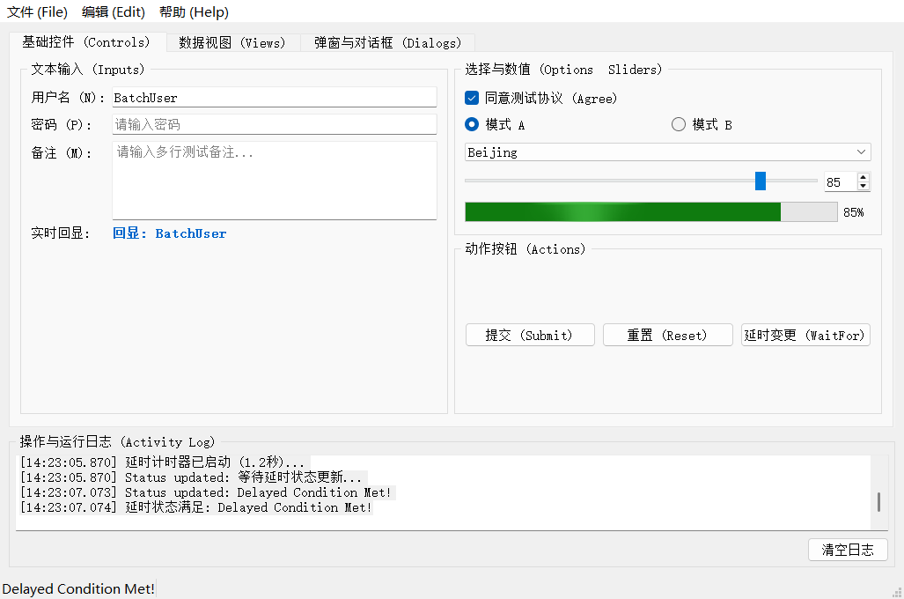

# QtMcpEmbedded 全功能验收测试报告

## 1. 测试概要

* **测试目标**：`D:\QtMcp\QtMcpEmbedded\examples\asplugin\`（改造后的全功能验收测试台）
* **启动方式**：Qt Creator (Desktop Qt 5.12.2 MSVC2019 64bit)
* **连接协议**：MCP Streamable HTTP JSON-RPC 2.0（`http://127.0.0.1:9142/mcp`）
* **测试结论**：**全部测试项 100% 通过（PASS）**。

---

## 2. 界面运行与自动化操作实况截图

以下为 MCP 自动化测试套件通过 `qt_screenshot` 工具实时截取并拉回的应用程序界面：

> **实况分析**：从截图中可见，自动化测试通过 MCP 成功执行了文本输入（`BatchUser`）、回显同步、复选框勾选、滑块设置（`85`）、进度条联动渲染（`85%`）、延时条件触发（`Delayed Condition Met!`）及日志回显。

---

## 3. 核心 21 项 MCP 工具验收清单与测试结果

| # | MCP 工具名称 | 对应测试动作 | 校验指标 | 结果 |
| :--- | :--- | :--- | :--- | :--- |
| 1 | `initialize` | MCP 客户端与 Qt 插件握手初始化 | 成功创建 Session，返回服务端名称与协议版本 | **PASS** |
| 2 | `tools/list` | 枚举服务端注册的全部工具 | 成功加载 21 项 MCP 工具 | **PASS** |
| 3 | `qt_list_windows` | 列出所有顶层窗口 | 成功识别到 `'QtMcp Test Suite - asplugin'` (892x680) | **PASS** |
| 4 | `qt_snapshot` | 完整遍历 UI 元素树 | 成功解析包含 Tab、布局与子控件在内的 63 个 UI 元素 | **PASS** |
| 5 | `qt_find_widget` | 按 `object_name: 'nameInput'` 查找组件 | 成功匹配并定位到唯一对象引用（ref: `w34`） | **PASS** |
| 6 | `qt_widget_details`| 读取组件的详细元数据与几何坐标 | 正确返回坐标尺寸（x:104, y:27, 320x24）与可见性 | **PASS** |
| 7 | `qt_type_text` | 模拟向 `nameInput` 输入文本 `'AntigravityUser'` | 输入后返回 `ok: true` 且控件内容更新 | **PASS** |
| 8 | `qt_get_text` | 读取 `echoLabel` 的回显文本 | 成功读取到 `'回显: AntigravityUser'` | **PASS** |
| 9 | `qt_key_press` | 向输入框触发键盘 `Return` 按键 | 成功发送键盘事件 | **PASS** |
| 10 | `qt_click` | 点击 `chkAgree` 复选框 | 切换复选框状态为选中（`checked: true`） | **PASS** |
| 11 | `qt_click` | 点击 `btnSubmit` 提交按钮 | 成功触发按钮槽函数与提交逻辑 | **PASS** |
| 12 | `qt_set_property` | 将 `sliderVolume.value` 动态设置为 `85` | 滑动条与关联的 `progressBar` 联动变化为 `85%` | **PASS** |
| 13 | `qt_invoke_slot` | 反射调用 `addNumbers(123, 456)` | 正确返回计算数值 `579` | **PASS** |
| 14 | `qt_invoke_slot` | 反射调用 `echo('Hello QtMcp!')` | 正确返回字符串 `'Echo: Hello QtMcp!'` | **PASS** |
| 15 | `qt_invoke_slot` | 反射调用 `toggleFlag(true)` | 正确返回布尔值 `false` | **PASS** |
| 16 | `qt_object_tree` | 以 `MainWindow` 为根生成 QObject 对象树 | 成功生成 17 个关键对象的深层关系树 | **PASS** |
| 17 | `qt_trigger_action`| 触发菜单栏中的 `'保存 (&Save)'` Action | 成功执行菜单 Action，状态栏显示已保存提示 | **PASS** |
| 18 | `qt_screenshot` | 截取主窗口运行画面 | 成功生成 Base64 PNG 图像数据（33,512 字节） | **PASS** |
| 19 | `qt_wait_for` | 点击延时按钮，等待状态变为 `'Delayed Condition Met!'` | 成功等待并在 1197ms 后捕获到异步属性变化 | **PASS** |
| 20 | `qt_batch` | 批量原子操作（设置文本 -> 读取文本） | 连续两步批处理全部成功完成 | **PASS** |
| 21 | `qt_debug_message`| 读取底层重定向捕获的 `qDebug()` 日志 | 成功读取 Qt 运行时日志记录 | **PASS** |

---

## 4. 总结
经过本次对 `examples/asplugin` 的针对性改造与全流程自动化执行，验证了 **QtMcpEmbedded 通用插件（Generic Plugin）模式完全具备对任意 Qt 程序的无侵入加载、UI 树探查、交互操作、事件触发、属性读写、槽函数反射、异步等待及图像截取能力**。
